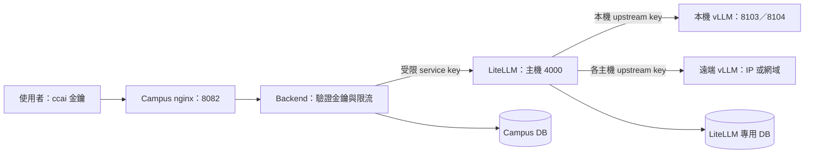

# AI API 使用與部署手冊

本手冊適用於 Campus 主 Compose 整合 LiteLLM 的部署方式。一般使用者從 Campus
取得 `ccai_*` 金鑰；維運人員統一在專案根目錄管理 Docker，模型連線集中在
`vllm-service/models.json`。以下部署指令除特別標示外，均在 `Campus-Cloud/` 執行。

## 1. 呼叫流程與檔案位置



| 檔案 | 用途 | 日常維護方式 |
| --- | --- | --- |
| `docker-compose.yml` | Campus 正式 Docker 入口；include 原 LiteLLM Compose | 根目錄 `docker compose` |
| `vllm-service/litellm/docker-compose.yml` | LiteLLM 服務定義；也保留獨立部署入口 | 修改一次，兩種啟動模式共用 |
| `.env` | Campus、backend/worker 到 LiteLLM 的 URL 與受限 service key | 保留現有值，不存 LiteLLM 管理／上游金鑰 |
| `vllm-service/litellm/.env` | LiteLLM master、salt、DB、各上游金鑰 | 僅注入 LiteLLM 容器 |
| `vllm-service/models.json` | 本機與遠端模型連線清單 | 新增／移除模型、調整 alias 或 IP |
| `vllm-service/litellm/config.template.yaml` | 共用 timeout、重試、健康檢查等政策 | 政策有變更才修改 |
| `vllm-service/litellm/config.yaml` | 由清單與 template 產生的 LiteLLM 路由 | 保留原位置；不要直接編輯 |
| `scripts/prepare-ai-stack.sh` | 設定預檢查、產生 production config、選擇性啟動 | 部署／改路由前執行 |

`config.yaml`、`models.json` 與實際 `.env` 均受 Git 忽略。範例與 template 可提交。
根目錄 `.dockerignore` 排除推論目錄與各層 `.env`，避免將模型權重／機密帶入 Campus build。
不將 LiteLLM `.env` 合併到主 `.env`：backend、worker、prestart 會讀取主 `.env`，
分開可讓高權限金鑰只進入 gateway。減少維護工作靠單一 Compose 定義、模型清單與預檢查。

## 2. 位址與金鑰怎麼填

主 `.env` 的 AI 區域：

```dotenv
AI_API_BASE_URL=http://host.docker.internal:4000
AI_API_API_KEY=<LiteLLM 核發給 Campus 的受限 service key>
LITELLM_RUNTIME_BASE_URL=http://host.docker.internal:4000
LITELLM_RUNTIME_API_KEY=<同一把受限 service key>
# 若原本已有這個欄位，須與 AI_API_API_KEY 一致；沒有可省略。
LITELLM_SERVICE_API_KEY=<同一把受限 service key>
AI_API_PUBLIC_BASE_URL=https://campus.example.edu
BACKEND_HOST_PORT=8000
REDIS_HOST_PORT=6379
```

`AI_API_PUBLIC_BASE_URL` 是使用者可以連線的 Campus 根網址；本機預設為
`http://localhost:8082`。API 完整 base URL 為該網址加上 `/api/v1/ai-proxy`。
如果 backend 直接跑在主機上，兩個 gateway URL 改用 `http://127.0.0.1:4000`；
主 Compose 模式則使用 `host.docker.internal`，容器的 `127.0.0.1` 只指向自己。
backend 與 worker 都已加入 `host-gateway` 映射。

LiteLLM `.env`：

```dotenv
LITELLM_MASTER_KEY=<gateway 管理金鑰>
VLLM_UPSTREAM_API_KEY=<與 vllm-service/.env.API 的 API_KEY 相同>
DATABASE_URL=postgresql://litellm:<已 URL 編碼的密碼>@127.0.0.1:5433/litellm
LITELLM_SALT_KEY=<第一次部署建立、後續固定保留的隨機金鑰>
# 有遠端模型才需要；名稱要對應 models.json 的 api_key_env。
REMOTE_LAB_API_KEY=<遠端 vLLM 的 API_KEY>
# 可選：填已驗證的 tag 或 digest，供可重現的升級／回滾。
# LITELLM_IMAGE=litellm/litellm:<tested-tag>
```

| 金鑰 | 使用者／服務 | 授權範圍 |
| --- | --- | --- |
| `ccai_*` | 一般使用者 → Campus | Campus 核准的個人 API 存取 |
| `AI_API_API_KEY` | Campus → LiteLLM | LiteLLM Virtual Key 允許的模型 |
| `LITELLM_MASTER_KEY` | 維運人員 → LiteLLM | gateway 管理與 Virtual Key 核發 |
| `VLLM_UPSTREAM_API_KEY`、遠端 key | LiteLLM → 推論主機 | 各上游的模型 API |

不要互相替代這幾類金鑰。一般使用者取得的是 `ccai_*`，不需知道推論主機 IP 或服務金鑰。
`LITELLM_RUNTIME_API_KEY` 未設定時，管理端 runtime 觀測功能維持關閉。

### DATABASE_URL 與 LITELLM_SALT_KEY

`DATABASE_URL` 是資料庫連線字串，不是紀錄內容本身。LiteLLM 透過它保存 Virtual Key
設定／驗證資料、用量與花費紀錄、使用者／團隊設定，以及自己的 schema。用量紀錄
是否包含請求內容取決於 LiteLLM 記錄設定；不要假設它只保存 token 數。
資料庫須使用獨立 DB 與登入帳號，不可指向 Campus 的應用程式 DB，也不可對它執行 Campus Alembic。

`LITELLM_SALT_KEY` 用於 LiteLLM 保存部分敏感設定／上游憑證時的加解密，不是使用者 API key。
固定保留，與 DB 一起備份、一起還原；直接換掉會使既有加密資料無法解密。
它不會將所有日誌自動加密。詳見 [LiteLLM 加密說明](https://docs.litellm.ai/docs/proxy/security_encryption_faq)。

同機主 Compose PostgreSQL 的預設主機埠為 `5433`；LiteLLM 使用 host network，
所以這裡可填 `127.0.0.1:5433`。若改了 `POSTGRES_HOST_PORT`，URL 也要相應更新。
使用遠端 DB 時填該主機的 IP／網域及連線參數，保留既有 DB 與 salt 即可。
整合 Compose 不會自動搬移資料庫，也不會依 `LITELLM_DB_*` 自動改寫 URL。

## 3. 本機與遠端模型清單

現行本機模型為 `gpt-oss-20B`（8103）與 `NVIDIA-Nemotron-Nano-9B-v2-FP8`（8104）；
實際對外名稱以 `models.json` 與 `/models` 回應為準。以下為欄位範例，請合併到現有
JSON 陣列，保留原有模型的 GPU、context、parser 等調校參數。

本機項目預設 `deployment` 為 `local`：

```json
{
  "alias": "gpt-oss-20B",
  "deployment": "local",
  "served_model_name": "gpt-oss-20B",
  "model_name": "./AImodels/gpt-oss-20B",
  "api_port": 8103,
  "gpu_memory_utilization": 0.4,
  "litellm": {"rpm": 10},
  "capabilities": {"chat": true}
}
```

遠端 vLLM 項目不需要 `model_name`、`api_port` 或本機 GPU 配置：

```json
{
  "alias": "remote-lab-chat",
  "deployment": "remote",
  "served_model_name": "lab-chat-model",
  "api_base": "http://192.0.2.20:8103/v1",
  "api_key_env": "REMOTE_LAB_API_KEY",
  "litellm": {"rpm": 10},
  "capabilities": {"chat": true}
}
```

`192.0.2.20` 是文件示例位址，須換成實際主機。遠端主機應先啟動模型，監聽 gateway
可達的介面，並允許 gateway 的來源連線；確認它的 `/v1/models` 確實提供
`lab-chat-model`。遠端 bearer key 只填入 LiteLLM `.env`，JSON 放環境變數「名稱」。
未指定 `api_key_env` 時沿用 `VLLM_UPSTREAM_API_KEY`。

`alias` 是呼叫端 `model` 欄位使用的名稱，所有項目都必須唯一；本機
`served_model_name`、`api_port` 也要唯一。不同遠端主機可使用相同上游模型名稱／埠，
但公開 alias 要不同。`api_base` 須含 `/v1`，不可把帳密寫入 URL。
目前產生器使用 `hosted_vllm` provider，這個範例針對遠端 vLLM；雲端原生 provider
或不同協定需另外擴充產生器，填 IP 不會自動轉換協定。
`capabilities` 是描述資料，仍需模型及 vLLM parser 實際支援才能啟用工具、推理或多模態功能。

本機 launcher 會略過 `remote`，不消耗本機 GPU。全遠端部署不需跑 cluster launcher。
舊備援 Gateway 只使用本機 launcher 路由，遠端路由由 LiteLLM 管理。

## 4. 正式啟動與既有獨立 gateway 接管

需要 Linux Docker Engine、Docker Compose 2.20 以上，以及包含 `PyYAML`、
`python-dotenv` 的 Python。腳本優先使用 `vllm-service/.venv/bin/python`，
也可用 `AI_STACK_PYTHON=/path/to/python` 指定。
Compose 的相對掛載路徑以被 include 的檔案目錄解析，詳見
[Docker include 說明](https://docs.docker.com/reference/compose-file/include/)。

### 已有部署：保留原設定

已有 `.env`、`models.json`、DB 與 service key 時，不要覆蓋成範例。確認第 2 節的
backend URL 已切為 Docker 主機映射，再執行：

```bash
# 本機模型若尚未執行才啟動；全遠端部署略過這一步。
bash vllm-service/start_multi_model_cluster.sh
bash scripts/prepare-ai-stack.sh --check-upstreams
```

預檢查核對 root／gateway 金鑰隔離、service key 一致性、local upstream key 與
`.env.API` 一致性、DB 名稱／帳號隔離、必要遠端 key，以及每個上游的 `/v1/models`。
它不核發 service key，也不會藉查詢模型清單啟動推論。成功後產生 production `config.yaml`。

若目前有 `campus-litellm` 獨立容器，先停它，再由主 Compose 啟動：

```bash
docker compose -f vllm-service/litellm/docker-compose.yml \
  --env-file vllm-service/litellm/.env stop litellm
bash scripts/prepare-ai-stack.sh --start
docker compose ps
curl -fsS http://127.0.0.1:4000/health/readiness
```

這個交接會短暫中斷 gateway。`--start` 會重新檢查上游，先重建 LiteLLM 以載入新路由，
再執行 `docker compose up -d --build` 啟動主專案；不會自動停止其他專案的 gateway。
若其他專案仍占用 4000，腳本會取消啟動並保留既有服務。
只接管 gateway 時，可在停止獨立容器後用 `docker compose up -d litellm`。
原獨立 Compose 保留原位，不需要複製一份到根目錄。

只驗證、不改檔：

```bash
bash scripts/prepare-ai-stack.sh --check-only --check-upstreams
```

### 全新部署：先建立專用 DB 與 service key

1. 用 `cp -n .env.example .env` 和
   `cp -n vllm-service/litellm/.env.example vllm-service/litellm/.env` 建立設定，
   填入 Campus 必要參數、真實 master／salt／upstream key、DB URL 與模型清單。
   master 與 salt 可各自用 `python3 -c 'import secrets; print(secrets.token_urlsafe(48))'` 產生；
   `VLLM_UPSTREAM_API_KEY` 則沿用本機 `.env.API` 的 API_KEY。
2. 使用既有專用 DB，或先啟動主 Compose 的 DB，再建立專用角色與資料庫：

   ```bash
   docker compose up -d db
   read -rsp 'LiteLLM DB password: ' LITELLM_DB_PASSWORD; echo
   export LITELLM_DB_PASSWORD
   bash scripts/init-litellm-db.sh
   unset LITELLM_DB_PASSWORD
   ```

   將同一密碼以 URL 編碼後填入 LiteLLM `.env` 的 `DATABASE_URL`。
   這個初始化腳本只處理主 Compose DB；外部 DB 由其管理者建立。
3. 啟動本機／遠端推論服務，尚未核發 service key 時，以 bootstrap 模式只產生 gateway 設定：

   ```bash
   vllm-service/.venv/bin/python vllm-service/tools/generate_litellm_config.py \
     --mode production --bootstrap
   docker compose up -d litellm
   curl -fsS http://127.0.0.1:4000/health/readiness
   ```

   `--bootstrap` 不啟動 Campus，也不建立或授權任何 key。一般部署走 prepare script。
4. 用 LiteLLM 管理 UI 或 `/key/generate` 核發只允許目前公開 aliases 的 service key。
   下列範例將結果保存在權限受限的暫存檔，不要將檔案提交到 Git：

   ```bash
   umask 077
   mkdir -p vllm-service/.runtime
   jq '{models: [.[] | .alias, (.legacy_aliases[]?.name)], key_alias: "campus-ai-api-service"}' \
     vllm-service/models.json > vllm-service/.runtime/service-key-request.json
   read -rsp 'LiteLLM master key: ' LITELLM_MASTER_KEY; echo
   export LITELLM_MASTER_KEY
   curl --fail --silent --show-error \
     --config <(printf 'header = "Authorization: Bearer %s"\n' "$LITELLM_MASTER_KEY") \
     -H 'Content-Type: application/json' \
     --data-binary @vllm-service/.runtime/service-key-request.json \
     http://127.0.0.1:4000/key/generate > vllm-service/.runtime/service-key-response.json
   unset LITELLM_MASTER_KEY
   ```

   將回應的 `key` 存入機密管理工具及 root `.env` 的 `AI_API_API_KEY`、
   `LITELLM_RUNTIME_API_KEY`（若使用 `LITELLM_SERVICE_API_KEY` 也要相同），再移除暫存檔。
5. 執行 `bash scripts/prepare-ai-stack.sh --start`，核准一把 Campus 測試用 `ccai_*`
   金鑰，完成第 6 節的公開 API 驗證。

### 手動部署 workflow

runner 需預先配置 `/opt/skylab/.env`、`/opt/skylab/vllm-service/litellm/.env`、
`/opt/skylab/vllm-service/models.json`；有本機模型時還需要
`/opt/skylab/vllm-service/.env.API`。這些檔案在 workflow checkout 後載入，
由預檢查產生 config，再 build／啟動主 Compose。runner 需能使用 `python3 -m venv`。
GPU 模型程序應由部署主機獨立管理，不放在可能被 checkout 清除的 runner 工作目錄。
首次部署需先完成 DB 與 service key 核發；目前 workflow 不會自動核發或搬移 DB。

## 5. 修改連線、重啟與回滾

新增模型／改 IP：修改 `models.json`，在 LiteLLM `.env` 加入對應 key，再執行：

```bash
bash scripts/prepare-ai-stack.sh --check-upstreams
docker compose up -d --force-recreate litellm
```

新增公開 alias 後，還需更新 Campus service Virtual Key 的模型 allowlist；
否則 master key 可見的新模型，Campus 使用者未必能呼叫。
改模型本體、GPU 或本機監聽埠時，也需要重啟本機推論 cluster。
改主 `.env` 後，用 `docker compose up -d --force-recreate backend worker` 讓容器讀到新值。
單純 `restart` 不會重新注入 `.env`。

| 操作 | 根目錄指令／影響 |
| --- | --- |
| 查看狀態 | `docker compose ps` |
| gateway 日誌 | `docker compose logs --tail 100 -f litellm` |
| 只停止 gateway | `docker compose stop litellm` |
| 重建 gateway | `docker compose up -d --force-recreate litellm` |
| 停止主 Docker stack | `docker compose down`，包含已接管的 LiteLLM |

`down` 不停止主機 vLLM 程序，也不刪除外部 LiteLLM DB。不要使用 `down -v` 作為日常停止指令。
缺少 config 時 Compose 的 bind mount 會直接失敗，不會誤建 `config.yaml/` 目錄。

退回獨立部署：先在 root `docker compose stop litellm`，再從
`vllm-service/litellm/` 執行 `docker compose up -d`。使用同一份 DB URL、salt 與 config。
回退到舊 Gateway 是不同操作，舊 Gateway 不提供同樣的 LiteLLM 管理與遠端路由能力。

## 6. 一般使用者申請與呼叫 API

登入 Campus 的 AI API 頁面，填用途、金鑰名稱與期限，送出申請。具審核權限的人員核准後，
使用者可查看自己的 key 與連線範例。key 清單只回傳前綴；單把明文僅提供擁有者。
輪替後舊 key 立即失效，需同步更新使用它的程式；可查看個人用量並撤銷不再使用的 key。

管理申請的 `/api/v1/ai-api/*` 使用 Campus 登入 bearer token；下列推論端點使用 `ccai_*`。
兩者不是同一種認證。SDK 或相容客戶端的 `base_url` 設為
`https://campus.example.edu/api/v1/ai-proxy`，不再加一段 `/v1`。

| 方法／端點（相對 base URL） | 用途 |
| --- | --- |
| `GET /models` | 查詢目前 service key 可用的模型 ID |
| `POST /chat/completions` | messages 對話，可使用 SSE 串流 |
| `POST /completions` | prompt 文字生成，需上游支援 |
| `POST /responses` | Responses 格式，需上游支援 |

Campus 不轉送 LiteLLM 的管理、key、DB 或 health API。embedding 等其他 endpoint
目前不在 Campus proxy 的公開範圍。

### curl 模型清單與對話

```bash
export CAMPUS_AI_BASE_URL='http://localhost:8082/api/v1/ai-proxy'
read -rsp 'Campus ccai key: ' CAMPUS_AI_API_KEY; echo
export CAMPUS_AI_API_KEY
curl --fail --silent --show-error \
  --config <(printf 'header = "Authorization: Bearer %s"\n' "$CAMPUS_AI_API_KEY") \
  "$CAMPUS_AI_BASE_URL/models"

curl --fail --silent --show-error \
  --config <(printf 'header = "Authorization: Bearer %s"\n' "$CAMPUS_AI_API_KEY") \
  -H 'Content-Type: application/json' \
  --data '{"model":"gpt-oss-20B","messages":[{"role":"user","content":"請用繁體中文簡述你的功能。"}],"max_tokens":512}' \
  "$CAMPUS_AI_BASE_URL/chat/completions"
```

把 `model` 換成 `/models` 回傳的 ID 可切換模型。串流時加 `"stream":true`，curl 加
`--no-buffer`，逐行接收 `data:` 事件。推理模型可能先耗用 reasoning tokens；若輸出
`content` 為空且 `finish_reason=length`，先增加 token 預算並核對模型 parser，不能僅據此判定連線故障。

Python 可直接透過 HTTP 呼叫，不依賴特定 SDK：

```python
import json
import os
from urllib.request import Request, urlopen

base = os.environ["CAMPUS_AI_BASE_URL"].rstrip("/")
request = Request(
    base + "/chat/completions",
    data=json.dumps({
        "model": "gpt-oss-20B",
        "messages": [{"role": "user", "content": "你好"}],
        "max_tokens": 512,
    }).encode(),
    headers={
        "Authorization": "Bearer " + os.environ["CAMPUS_AI_API_KEY"],
        "Content-Type": "application/json",
    },
)
with urlopen(request, timeout=120) as response:
    payload = json.load(response)
print(payload["choices"][0]["message"])
```

### 維運驗證

```bash
bash scripts/prepare-ai-stack.sh --check-only --check-upstreams
curl -fsS http://127.0.0.1:4000/health/liveliness
curl -fsS http://127.0.0.1:4000/health/readiness
# 已啟動 Campus backend 時，使用管理 key 驗證 gateway 清單、上游與 backend 連線。
read -rsp 'LiteLLM master key: ' LITELLM_MASTER_KEY; echo
export LITELLM_MASTER_KEY
bash scripts/verify-litellm-staging.sh
unset LITELLM_MASTER_KEY

# 使用已核准的 Campus 測試 key 驗證四種公開 endpoint。
export AI_API_SMOKE_KEY="$CAMPUS_AI_API_KEY"
AI_API_PUBLIC_BASE_URL=http://localhost:8082/api/v1 \
  AI_API_SMOKE_MODEL=gpt-oss-20B bash scripts/verify-ai-api-cutover.sh
unset AI_API_SMOKE_KEY
```

`verify-ai-api-cutover.sh` 包含實際生成與串流請求，會產生模型用量；請用專用測試 key。
該腳本需要 curl、jq，且測試模型要支援 completions 與 responses。全部通過表示對應
路徑正常，不代表其他模型也支援所有格式。操作結束可 `unset CAMPUS_AI_API_KEY`。

## 7. 常見問題

| 現象 | 檢查與處理 |
| --- | --- |
| `4000` 已占用／有兩個 gateway | `docker ps` 核對 Compose project；停止舊 gateway 再接管 |
| backend 無法連線 gateway | 核對 `AI_API_BASE_URL`，Docker 不使用 `127.0.0.1`；確認 host-gateway 映射及允許的來源 |
| 本機上游 401 | `.env.API` 的 `API_KEY` 要與 LiteLLM 上游 key 相同 |
| 遠端模型連線失敗 | IP／網域、監聽介面、防火牆、`/v1`、served model name、key 是否一致 |
| Campus 401／403 | 檢查 `ccai_*` 是否核准、過期、撤銷；後台 service Virtual Key 是否有效／允許模型 |
| 模型清單少了新模型 | 確認已重新產生 config、重建 LiteLLM，並更新 service key allowlist |
| 429 | Campus 限流或 LiteLLM RPM 限制；依 `Retry-After` 延後重試 |
| 413／415 | 請求超過 `AI_API_MAX_REQUEST_BODY_BYTES`，或 Content-Type 不是 JSON |
| 502／503 | 檢查 gateway、上游與 DB 是否可用，再看 backend／LiteLLM 日誌 |
| DB 認證／migration 失敗 | 核對專用角色、密碼 URL 編碼、DB 主機與埠；不要改用 Campus DB |
| salt 更換後不能解密 | 還原原 salt 與對應 DB 備份，不能以新 salt 修復舊密文 |
| 修改 `.env` 沒生效 | 用 `up -d --force-recreate` 重建相關容器 |
| `8000` 或 `6379` 衝突 | 設 `BACKEND_HOST_PORT`／`REDIS_HOST_PORT`；容器間服務埠保持原值 |

LiteLLM host network 會監聽主機 `4000`，請依現有網路政策只允許 backend、維運與監控
來源連線。使用者的正常入口是 Campus。完整 LiteLLM 功能與 key 管理請參考
[Virtual Keys](https://docs.litellm.ai/docs/proxy/virtual_keys) 與
[vLLM provider](https://docs.litellm.ai/docs/providers/vllm)。
