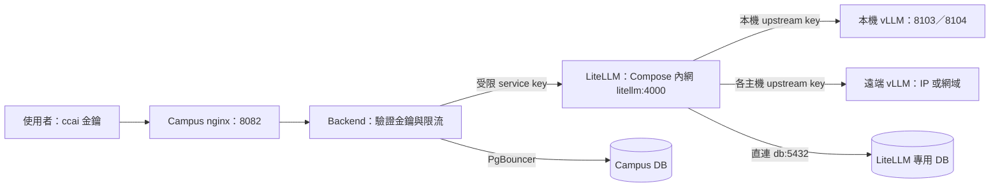

# AI API 使用與部署手冊

本手冊適用於 Campus 主 Compose 整合 LiteLLM 的部署方式。一般使用者從 Campus
取得 `ccai_*` 金鑰；維運人員統一在專案根目錄管理 Docker，模型連線集中在
`vllm-service/models.json`。以下部署指令除特別標示外，均在 `Campus-Cloud/` 執行。

## 1. 呼叫流程與檔案位置


```mermaid
flowchart LR
    U[使用者：ccai 金鑰] --> N[Campus nginx：8082]
    N --> B[Backend：驗證金鑰與限流]
    B -->|受限 service key| L[LiteLLM：Compose 內網 litellm:4000]
    L -->|本機 upstream key| V[本機 vLLM：8103／8104]
    L -->|各主機 upstream key| R[遠端 vLLM：IP 或網域]
    B -->|PgBouncer| C[(Campus DB)]
    L -->|直連 db:5432| D[(LiteLLM 專用 DB)]
```

LiteLLM 與 backend／worker 同在 Compose `skylab` 內網，backend 以 `http://litellm:4000` 呼叫；
LiteLLM 直連同一台 PostgreSQL 的專用資料庫（`db:5432`），不經 PgBouncer。主機上只有
`127.0.0.1:4000` 供健康檢查、金鑰核發與管理工具使用。LiteLLM 不接 nginx：使用者一律經
Campus `/api/v1/ai-proxy` 由 backend 驗證 `ccai_*` 金鑰與限流後轉送，LiteLLM 的管理 UI、
`/key/*` 與 health API 不對外公開；需要管理 UI 時從部署機本機或 SSH tunnel 連 `127.0.0.1:4000`。

| 檔案 | 用途 | 日常維護方式 |
| --- | --- | --- |
| `docker-compose.yml` | Campus 正式 Docker 入口；include 原 LiteLLM Compose | 根目錄 `docker compose` |
| `vllm-service/litellm/docker-compose.yml` | LiteLLM 服務定義；也保留獨立部署入口 | 修改一次，兩種啟動模式共用 |
| `.env` | Campus、backend/worker 到 LiteLLM 的 URL 與受限 service key | 保留現有值，不存 LiteLLM 管理／上游金鑰 |
| `vllm-service/litellm/.env` | LiteLLM master、salt、DB、各上游金鑰 | 僅注入 LiteLLM 容器 |
| `vllm-service/models.json` | 本機與遠端模型連線清單 | 新增／移除模型、調整 alias 或 IP |
| `vllm-service/litellm/config.template.yaml` | 共用 timeout、重試、健康檢查等政策 | 政策有變更才修改 |
| `vllm-service/litellm/config.yaml` | 由清單與 template 產生的 LiteLLM 路由 | 保留原位置；不要直接編輯 |
| `scripts/prepare-ai-stack.sh` | `--init-env` 補齊金鑰；預檢查、產生 production config；`--start` 自動建 DB、核發／同步 service key 並啟動 | 部署／改路由前執行 |

`config.yaml`、`models.json` 與實際 `.env` 均受 Git 忽略。範例與 template 可提交。
根目錄 `.dockerignore` 排除推論目錄與各層 `.env`，避免將模型權重／機密帶入 Campus build。
不將 LiteLLM `.env` 合併到主 `.env`：backend、worker、prestart 會讀取主 `.env`，
分開可讓高權限金鑰只進入 gateway。減少維護工作靠單一 Compose 定義、模型清單與預檢查。

## 2. 位址與金鑰怎麼填

主 `.env` 的 AI 區域：

```dotenv
AI_API_BASE_URL=http://litellm:4000
AI_API_API_KEY=<sk- 開頭的受限 service key；--init-env 自動產生>
LITELLM_RUNTIME_BASE_URL=http://litellm:4000
LITELLM_RUNTIME_API_KEY=<同一把受限 service key；--init-env 自動填入>
# 若原本已有這個欄位，須與 AI_API_API_KEY 一致；沒有可省略。
LITELLM_SERVICE_API_KEY=<同一把受限 service key>
AI_API_PUBLIC_BASE_URL=https://campus.example.edu
BACKEND_HOST_PORT=8000
REDIS_HOST_PORT=6379
```

`AI_API_PUBLIC_BASE_URL` 是使用者可以連線的 Campus 根網址；本機預設為
`http://localhost:8082`。API 完整 base URL 為該網址加上 `/api/v1/ai-proxy`。
如果 backend 直接跑在主機上，兩個 gateway URL 改用 `http://127.0.0.1:4000`；
主 Compose 模式一律用服務名稱 `litellm`（預檢查會擋 `127.0.0.1` 與舊的 `host.docker.internal`）。

`AI_API_API_KEY` 由部署端決定、LiteLLM 依它登記：`--start` 會用 master key 在 LiteLLM
以這個值建立 Virtual Key（別名 `campus-ai-api-service`），已存在時則把模型白名單同步成
`models.json` 目前的 alias。沿用既有 LiteLLM 資料庫時，把當初核發給 Campus 的那把 key 填進來即可。

LiteLLM `.env`：

```dotenv
LITELLM_MASTER_KEY=<gateway 管理金鑰；--init-env 自動產生>
VLLM_UPSTREAM_API_KEY=<推論主機 vLLM 的 API_KEY；本機模型與 .env.API 相同>
DATABASE_URL=postgresql://litellm:<已 URL 編碼的密碼>@db:5432/litellm
LITELLM_SALT_KEY=<第一次部署建立、後續固定保留的隨機金鑰；--init-env 自動產生>
# 有遠端模型才需要；名稱要對應 models.json 的 api_key_env。
REMOTE_LAB_API_KEY=<遠端 vLLM 的 API_KEY>
# 可選：主機端埠（只綁 127.0.0.1），供健康檢查與管理工具。
# LITELLM_HOST_PORT=4000
# 可選：填已驗證的 tag 或 digest，供可重現的升級／回滾。
# LITELLM_IMAGE=litellm/litellm:<tested-tag>
```

`--init-env` 只補缺少或仍為範例值（`replace-with-*`、`ai-api-secret-*`）的項目，既有真實值一律不動，
所以可以重複執行。上游 vLLM 金鑰無法產生，本機模型會從 `.env.API` 複製，遠端主機的 key 需手動填入。

| 金鑰 | 使用者／服務 | 授權範圍 |
| --- | --- | --- |
| `ccai_*` | 一般使用者 → Campus | Campus 核准的個人 API 存取 |
| `AI_API_API_KEY` | Campus → LiteLLM | LiteLLM Virtual Key 允許的模型 |
| `LITELLM_MASTER_KEY` | 維運人員 → LiteLLM | gateway 管理與 Virtual Key 核發 |
| `VLLM_UPSTREAM_API_KEY`、遠端 key | LiteLLM → 推論主機 | 各上游的模型 API |

不要互相替代這幾類金鑰。一般使用者取得的是 `ccai_*`，不需知道推論主機 IP 或服務金鑰。
`LITELLM_RUNTIME_API_KEY` 未設定時，管理端 runtime 觀測功能維持關閉。

### DATABASE_URL 與 LITELLM_SALT_KEY

`DATABASE_URL` 是資料庫連線字串，不是紀錄內容本身。LiteLLM 透過它保存 Virtual Key
設定／驗證資料、用量與花費紀錄、使用者／團隊設定，以及自己的 schema。用量紀錄
是否包含請求內容取決於 LiteLLM 記錄設定；不要假設它只保存 token 數。
資料庫須使用獨立 DB 與登入帳號，不可指向 Campus 的應用程式 DB，也不可對它執行 Campus Alembic。

`LITELLM_SALT_KEY` 用於 LiteLLM 保存部分敏感設定／上游憑證時的加解密，不是使用者 API key。
固定保留，與 DB 一起備份、一起還原；直接換掉會使既有加密資料無法解密。
它不會將所有日誌自動加密。詳見 [LiteLLM 加密說明](https://docs.litellm.ai/docs/proxy/security_encryption_faq)。

同機部署時 LiteLLM 與主 Compose PostgreSQL 在同一內網，URL 主機填 `db:5432`，與 `POSTGRES_HOST_PORT`
無關；不可填 `pgbouncer`（LiteLLM 的 Prisma 需要 session 語意），也不可填 `127.0.0.1`（容器內指向自己）。
主機為 `db` 時，`--start` 會以 URL 內的帳號、密碼、資料庫名稱自動建立專用角色與資料庫（已存在則把角色
密碼對齊 URL），並驗證該角色對 Campus 資料庫沒有建表權限；LiteLLM 啟動時自行跑 schema migration。
使用遠端 DB 時填該主機的 IP／網域及連線參數，保留既有 DB 與 salt 即可；外部 DB 由其管理者建立，腳本不會碰。
整合 Compose 不會自動搬移資料庫。舊版 host network 設定的 `127.0.0.1:5433` 會由 `--init-env` 改寫為 `db:5432`。

## 3. 本機與遠端模型清單

現行本機模型為 `gpt-oss-20B`（8103）與 `NVIDIA-Nemotron-Nano-9B-v2-FP8`（8104）；
實際對外名稱以 `models.json` 與 `/models` 回應為準。以下為欄位範例，請合併到現有
JSON 陣列，保留原有模型的 GPU、context、parser 等調校參數。

本機項目預設 `deployment` 為 `local`：

```json
{
  "alias": "gpt-oss-20B",
  "deployment": "local",
  "served_model_name": "gpt-oss-20B",
  "model_name": "./AImodels/gpt-oss-20B",
  "api_port": 8103,
  "gpu_memory_utilization": 0.4,
  "litellm": {"rpm": 10},
  "capabilities": {"chat": true}
}
```

遠端 vLLM 項目不需要 `model_name`、`api_port` 或本機 GPU 配置：

```json
{
  "alias": "remote-lab-chat",
  "deployment": "remote",
  "served_model_name": "lab-chat-model",
  "api_base": "http://192.0.2.20:8103/v1",
  "api_key_env": "REMOTE_LAB_API_KEY",
  "litellm": {"rpm": 10},
  "capabilities": {"chat": true}
}
```

`192.0.2.20` 是文件示例位址，須換成實際主機。遠端主機應先啟動模型，監聽 gateway
可達的介面，並允許 gateway 的來源連線；確認它的 `/v1/models` 確實提供
`lab-chat-model`。遠端 bearer key 只填入 LiteLLM `.env`，JSON 放環境變數「名稱」。
未指定 `api_key_env` 時沿用 `VLLM_UPSTREAM_API_KEY`。

`alias` 是呼叫端 `model` 欄位使用的名稱，所有項目都必須唯一；本機
`served_model_name`、`api_port` 也要唯一。不同遠端主機可使用相同上游模型名稱／埠，
但公開 alias 要不同。`api_base` 須含 `/v1`，不可把帳密寫入 URL。
目前產生器使用 `hosted_vllm` provider，這個範例針對遠端 vLLM；雲端原生 provider
或不同協定需另外擴充產生器，填 IP 不會自動轉換協定。
`capabilities` 是描述資料，仍需模型及 vLLM parser 實際支援才能啟用工具、推理或多模態功能。

本機 launcher 會略過 `remote`，不消耗本機 GPU。全遠端部署不需跑 cluster launcher。
舊備援 Gateway 只使用本機 launcher 路由，遠端路由由 LiteLLM 管理。

## 4. 正式啟動與既有獨立 gateway 接管

需要 Linux Docker Engine、Docker Compose 2.20 以上，以及包含 `PyYAML`、
`python-dotenv` 的 Python。腳本優先使用 `vllm-service/.venv/bin/python`，
也可用 `AI_STACK_PYTHON=/path/to/python` 指定。
Compose 的相對掛載路徑以被 include 的檔案目錄解析，詳見
[Docker include 說明](https://docs.docker.com/reference/compose-file/include/)。

### 部署三步驟（全新或既有部署共用）

```bash
# 1. 補齊金鑰與位址：缺少或仍為範例值才寫入，既有真實值不動（可重複執行）
bash scripts/prepare-ai-stack.sh --init-env
# 2. 填入 --init-env 提示的上游金鑰（例如 DGX 的 VLLM_UPSTREAM_API_KEY），並備妥 models.json
# 3. 預檢查、產生 config、建 DB、啟動 LiteLLM、核發／同步 service key，最後啟動主 Compose
bash scripts/prepare-ai-stack.sh --start
```

主 `.env` 需先由 `.env.example` 建立並填好 Campus 必要參數；LiteLLM `.env` 不存在時
`--init-env` 會由範本建立。`--init-env` 會自動產生：

- LiteLLM `LITELLM_MASTER_KEY`（`sk-` 開頭）、`LITELLM_SALT_KEY`；
- `DATABASE_URL`（`litellm` 帳號、隨機密碼、`db:5432/litellm`）；
- 主 `.env` 的 `AI_API_API_KEY` 與 `LITELLM_RUNTIME_API_KEY`（同一把 `sk-` key），
  並把兩個 gateway URL 設為 `http://litellm:4000`。

`--start` 依序執行：

1. 核對 root／gateway 金鑰隔離、service key 一致性、local upstream key 與 `.env.API`
   一致性、DB 名稱／帳號隔離、必要遠端 key（不查詢上游；需要時另跑 `--check-only --check-upstreams`）；
2. 產生 production `config.yaml`；
3. `DATABASE_URL` 主機為 `db` 時，啟動主 Compose PostgreSQL，等它接受 TCP 連線後
   建立（或對齊密碼）專用角色與資料庫；
4. 重建 LiteLLM 以載入新路由，等 `/health/readiness` 回報資料庫已連線（首次會先跑 migration）；
5. 以 master key 在 LiteLLM 登記 `AI_API_API_KEY`（別名 `campus-ai-api-service`），
   已存在則把模型白名單同步成 `models.json` 目前的 alias；
6. `docker compose up -d --build` 啟動主專案。

它不會自動停止其他專案的 gateway；若另有獨立 `campus-litellm` 在跑，腳本會取消啟動並保留既有服務，
先停它再重跑：

```bash
docker compose -f vllm-service/litellm/docker-compose.yml \
  --env-file vllm-service/litellm/.env stop litellm
bash scripts/prepare-ai-stack.sh --start
docker compose ps
curl -fsS http://127.0.0.1:4000/health/readiness
```

只驗證、不改檔：

```bash
bash scripts/prepare-ai-stack.sh --check-only --check-upstreams
```

本機模型若尚未執行，先 `bash vllm-service/start_multi_model_cluster.sh`；全遠端部署略過。
LiteLLM 在容器內，本機 vLLM 須監聽 Docker 可達的介面：`.env.API` 設 `API_HOST=0.0.0.0`，
並以防火牆限制 8103／8104 只供本機與 Docker 網段，預檢查會擋只綁 loopback 的設定。

### 沿用既有 LiteLLM 資料庫

保留原本的 `LITELLM_MASTER_KEY`、`LITELLM_SALT_KEY` 與 `DATABASE_URL`（外部主機填其 IP／網域，
腳本不會嘗試建立），並把當初核發給 Campus 的 service key 填入主 `.env` 的 `AI_API_API_KEY`、
`LITELLM_RUNTIME_API_KEY`。`--init-env` 看到真實值就不會改動；`--start` 只同步該 key 的模型白名單。

### 從舊版 host network 部署升級

舊設定的 `AI_API_BASE_URL=http://host.docker.internal:4000` 與
`DATABASE_URL=...@127.0.0.1:5433/...` 在內網架構下連不到。執行一次 `--init-env`，它會把 gateway URL
改成 `http://litellm:4000`、把資料庫主機改成 `db:5432`（帳號密碼不變），再 `--start`。

### 手動部署 workflow

runner 需預先配置 `/opt/skylab/.env` 與 `/opt/skylab/vllm-service/models.json`；有本機模型時還需要
`/opt/skylab/vllm-service/.env.API`。workflow 會先對 `/opt/skylab` 執行 `--init-env`
（缺少的 LiteLLM `.env` 由範本建立；金鑰寫回 `/opt/skylab` 才能跨次部署保留，什麼都不缺時不寫檔），
上游金鑰仍缺時在此步驟失敗；接著把檔案複製進 checkout，由 `--start` 完成建 DB、核發 key 與啟動。
runner 需能使用 `python3 -m venv`，並對 `/opt/skylab` 有寫入權限（首次補金鑰時）。
GPU 模型程序應由部署主機獨立管理，不放在可能被 checkout 清除的 runner 工作目錄。

## 5. 修改連線、重啟與回滾

新增模型／改 IP：修改 `models.json`，在 LiteLLM `.env` 加入對應 key，再執行：

```bash
bash scripts/prepare-ai-stack.sh --start
```

`--start` 會重建 LiteLLM 載入新路由，並把 Campus service Virtual Key 的模型白名單同步成新的
alias 清單，不必另外呼叫 `/key/update`。只用 `docker compose up -d --force-recreate litellm`
重建時白名單不會同步，新模型對 Campus 使用者仍不可用。
改模型本體、GPU 或本機監聽埠時，也需要重啟本機推論 cluster。
改主 `.env` 後，用 `docker compose up -d --force-recreate backend worker` 讓容器讀到新值。
單純 `restart` 不會重新注入 `.env`。

| 操作 | 根目錄指令／影響 |
| --- | --- |
| 查看狀態 | `docker compose ps` |
| gateway 日誌 | `docker compose logs --tail 100 -f litellm` |
| 只停止 gateway | `docker compose stop litellm` |
| 重建 gateway | `docker compose up -d --force-recreate litellm` |
| 停止主 Docker stack | `docker compose down`，包含已接管的 LiteLLM |

**監控**：「資源監控 → 系統健康」會列出 AI Gateway（LiteLLM）與每個模型的狀態，模型的上游推論服務
（例如 DGX）連不到時發系統告警並寄信給管理員。有啟用監控 stack 時，Grafana「SkyLab AI」儀表板顯示
Campus 請求量／錯誤／延遲、LiteLLM 與 vLLM 引擎指標；vLLM 的抓取目標由 `--start` 依 `models.json`
自動產生，遠端主機防火牆要放行部署機連推論埠（與 LiteLLM 同一條規則）。細節見
[系統監控](monitoring.md#ai-模組監控)。

`down` 不停止主機 vLLM 程序，也不刪除外部 LiteLLM DB。不要使用 `down -v` 作為日常停止指令。
缺少 config 時 Compose 的 bind mount 會直接失敗，不會誤建 `config.yaml/` 目錄。

退回獨立部署：先在 root `docker compose stop litellm`，再從
`vllm-service/litellm/` 執行 `docker compose up -d`。使用同一份 DB URL、salt 與 config。
回退到舊 Gateway 是不同操作，舊 Gateway 不提供同樣的 LiteLLM 管理與遠端路由能力。

## 6. 一般使用者申請與呼叫 API

登入 Campus 的 AI API 頁面，填用途、金鑰名稱與期限，送出申請。具審核權限的人員核准後，
使用者可查看自己的 key 與連線範例。key 清單只回傳前綴；單把明文僅提供擁有者。
輪替後舊 key 立即失效，需同步更新使用它的程式；可查看個人用量並撤銷不再使用的 key。

管理申請的 `/api/v1/ai-api/*` 使用 Campus 登入 bearer token；下列推論端點使用 `ccai_*`。
兩者不是同一種認證。SDK 或相容客戶端的 `base_url` 設為
`https://campus.example.edu/api/v1/ai-proxy`，不再加一段 `/v1`。

| 方法／端點（相對 base URL） | 用途 |
| --- | --- |
| `GET /models` | 查詢目前 service key 可用的模型 ID |
| `POST /chat/completions` | messages 對話，可使用 SSE 串流 |
| `POST /completions` | prompt 文字生成，需上游支援 |
| `POST /responses` | Responses 格式，需上游支援 |

Campus 不轉送 LiteLLM 的管理、key、DB 或 health API。embedding 等其他 endpoint
目前不在 Campus proxy 的公開範圍。

### curl 模型清單與對話

```bash
export CAMPUS_AI_BASE_URL='http://localhost:8082/api/v1/ai-proxy'
read -rsp 'Campus ccai key: ' CAMPUS_AI_API_KEY; echo
export CAMPUS_AI_API_KEY
curl --fail --silent --show-error \
  --config <(printf 'header = "Authorization: Bearer %s"\n' "$CAMPUS_AI_API_KEY") \
  "$CAMPUS_AI_BASE_URL/models"

curl --fail --silent --show-error \
  --config <(printf 'header = "Authorization: Bearer %s"\n' "$CAMPUS_AI_API_KEY") \
  -H 'Content-Type: application/json' \
  --data '{"model":"gpt-oss-20B","messages":[{"role":"user","content":"請用繁體中文簡述你的功能。"}],"max_tokens":512}' \
  "$CAMPUS_AI_BASE_URL/chat/completions"
```

把 `model` 換成 `/models` 回傳的 ID 可切換模型。串流時加 `"stream":true`，curl 加
`--no-buffer`，逐行接收 `data:` 事件。推理模型可能先耗用 reasoning tokens；若輸出
`content` 為空且 `finish_reason=length`，先增加 token 預算並核對模型 parser，不能僅據此判定連線故障。

Python 可直接透過 HTTP 呼叫，不依賴特定 SDK：

```python
import json
import os
from urllib.request import Request, urlopen

base = os.environ["CAMPUS_AI_BASE_URL"].rstrip("/")
request = Request(
    base + "/chat/completions",
    data=json.dumps({
        "model": "gpt-oss-20B",
        "messages": [{"role": "user", "content": "你好"}],
        "max_tokens": 512,
    }).encode(),
    headers={
        "Authorization": "Bearer " + os.environ["CAMPUS_AI_API_KEY"],
        "Content-Type": "application/json",
    },
)
with urlopen(request, timeout=120) as response:
    payload = json.load(response)
print(payload["choices"][0]["message"])
```

### 維運驗證

```bash
bash scripts/prepare-ai-stack.sh --check-only --check-upstreams
curl -fsS http://127.0.0.1:4000/health/liveliness
curl -fsS http://127.0.0.1:4000/health/readiness
# 已啟動 Campus backend 時，使用管理 key 驗證 gateway 清單、上游與 backend 連線。
read -rsp 'LiteLLM master key: ' LITELLM_MASTER_KEY; echo
export LITELLM_MASTER_KEY
bash scripts/verify-litellm-staging.sh
unset LITELLM_MASTER_KEY

# 使用已核准的 Campus 測試 key 驗證四種公開 endpoint。
export AI_API_SMOKE_KEY="$CAMPUS_AI_API_KEY"
AI_API_PUBLIC_BASE_URL=http://localhost:8082/api/v1 \
  AI_API_SMOKE_MODEL=gpt-oss-20B bash scripts/verify-ai-api-cutover.sh
unset AI_API_SMOKE_KEY
```

`verify-ai-api-cutover.sh` 包含實際生成與串流請求，會產生模型用量；請用專用測試 key。
該腳本需要 curl、jq，且測試模型要支援 completions 與 responses。全部通過表示對應
路徑正常，不代表其他模型也支援所有格式。操作結束可 `unset CAMPUS_AI_API_KEY`。

## 7. 常見問題

| 現象 | 檢查與處理 |
| --- | --- |
| `4000` 已占用／有兩個 gateway | `docker ps` 核對 Compose project；停止舊 gateway 再接管；或設 `LITELLM_HOST_PORT` |
| backend 無法連線 gateway | `AI_API_BASE_URL` 應為 `http://litellm:4000`（舊的 `host.docker.internal` 已不適用，跑 `--init-env` 改寫） |
| 本機上游 401 | `.env.API` 的 `API_KEY` 要與 LiteLLM 上游 key 相同 |
| 本機上游連不到 | `.env.API` 的 `API_HOST` 須為 `0.0.0.0`（容器經 `host.docker.internal` 連入），並以防火牆限制引擎埠 |
| 遠端模型連線失敗 | IP／網域、監聽介面、防火牆、`/v1`、served model name、key 是否一致 |
| Campus 401／403 | 檢查 `ccai_*` 是否核准、過期、撤銷；service Virtual Key 是否有效／允許模型（`--start` 會重新登記並同步） |
| 模型清單少了新模型 | 用 `--start` 重新部署：會重產 config、重建 LiteLLM 並同步 service key 白名單 |
| `--start` 卡在 LiteLLM 就緒 | `docker compose logs litellm`；多半是 `DATABASE_URL` 帳密／主機錯誤或首次 migration 仍在跑 |
| key 核發回 HTTP 400 | 已有別把 key 用了別名 `campus-ai-api-service`：把那把 key 填進 `AI_API_API_KEY`，或在 LiteLLM 撤銷後重跑 |
| 429 | Campus 限流或 LiteLLM RPM 限制；依 `Retry-After` 延後重試 |
| 413／415 | 請求超過 `AI_API_MAX_REQUEST_BODY_BYTES`，或 Content-Type 不是 JSON |
| 502／503 | 檢查 gateway、上游與 DB 是否可用，再看 backend／LiteLLM 日誌 |
| DB 認證／migration 失敗 | 核對專用角色、密碼 URL 編碼、DB 主機與埠；不要改用 Campus DB |
| salt 更換後不能解密 | 還原原 salt 與對應 DB 備份，不能以新 salt 修復舊密文 |
| 修改 `.env` 沒生效 | 用 `up -d --force-recreate` 重建相關容器 |
| `8000` 或 `6379` 衝突 | 設 `BACKEND_HOST_PORT`／`REDIS_HOST_PORT`；容器間服務埠保持原值 |

LiteLLM 只在主機 `127.0.0.1:4000` 開埠，外部網路連不到；容器間一律走 Compose 內網。
使用者的正常入口是 Campus（nginx → backend），LiteLLM 不經 nginx 對外。完整 LiteLLM 功能與 key 管理請參考
[Virtual Keys](https://docs.litellm.ai/docs/proxy/virtual_keys) 與
[vLLM provider](https://docs.litellm.ai/docs/providers/vllm)。
