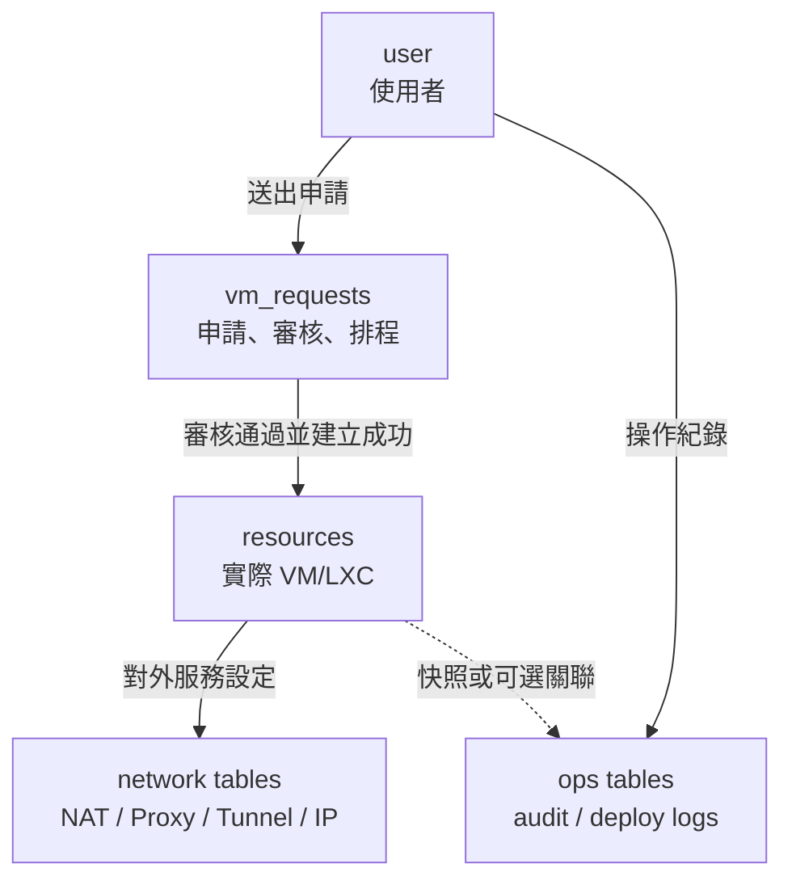
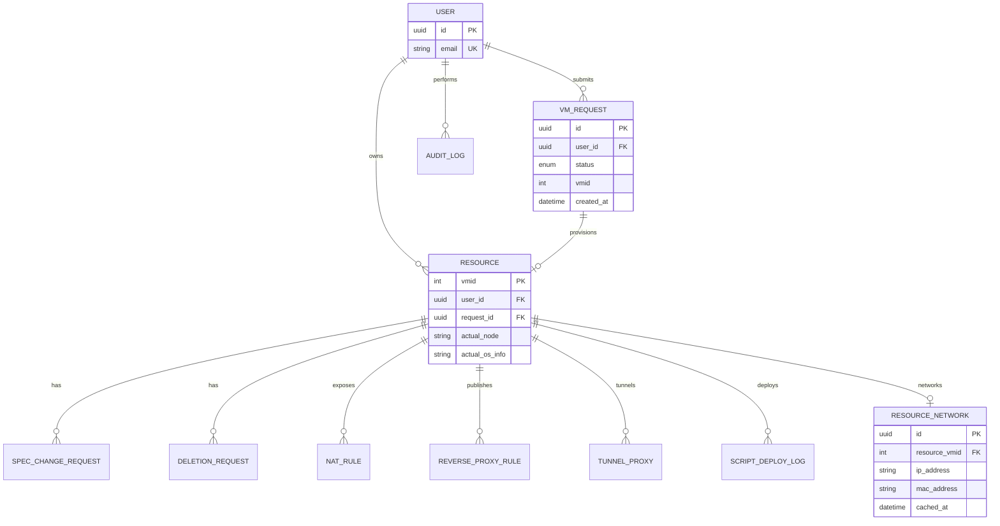

# Campus Cloud 資料庫優化方案 README

> 本文件整理目前 Campus Cloud 資料庫可優化方向。  
> 本階段 **不拆 PostgreSQL schema**，所有資料表仍維持在目前預設 schema 中；優化重點放在正規化、減少多餘欄位、補足關聯、避免孤立資料、提升查詢效能與資料一致性。

## 1. 優化目標

目前資料庫已能支撐 VM/LXC 申請、Proxmox 資源管理、AI API、網路設定與稽核紀錄等功能，但仍存在以下問題：

1. 多個資料表使用 `vmid` 當作隱性關聯，缺少正式 Foreign Key。
2. `vm_requests` 與 `resources` 有部分欄位語意重疊，容易造成資料不同步。
3. NAT、Reverse Proxy、Tunnel、IP allocation 等表與資源表連線不足，容易產生孤立資料。
4. 部分自由字串欄位應改為 enum 或 check constraint。
5. 熱門查詢缺少複合索引，例如待審申請、我的資源、排程掃描、AI 使用量統計。
6. 敏感欄位如 VM 初始密碼不應長期明文保存。

本方案目標如下：

- 建立 `vm_requests -> resources` 的清楚生命週期關聯。
- 將與實際 VM/LXC 綁定的表正式關聯到 `resources`。
- 對歷史紀錄類資料保留快照，不盲目 cascade delete。
- 減少重複欄位造成的資料不一致。
- 補上必要索引、唯一限制與 check constraint。
- 在不拆 schema 的前提下，讓資料庫結構更接近正式系統可維護狀態。

## 2. 核心資料生命週期

Campus Cloud 的核心資料生命週期應區分為「申請紀錄」與「實際資源」：



### 設計原則

| 類型 | 應保存內容 | 是否強制 FK |
|---|---|---|
| `vm_requests` | 申請當下的需求、審核狀態、排程資料 | FK 到 `user`、可回連 `resources` |
| `resources` | 實際建立成功的 VM/LXC metadata | FK 到 `user` 與來源 `vm_requests` |
| 網路設定表 | 實際資源的 NAT、Reverse Proxy、Tunnel、IP | 建議 FK 到 `resources` |
| 歷史紀錄表 | 操作當下的快照、錯誤、輸出 | 可 FK，但刪除時應 `SET NULL` 或保留快照 |
| 設定表 | Proxmox、Gateway、Cloudflare、Subnet | 通常 singleton，不需 FK |

## 3. 建議的正規化後關聯



## 4. 多餘欄位整理

### 4.1 `vm_requests` 與 `resources` 欄位語意

目前 `vm_requests` 與 `resources` 有部分欄位概念重複，例如 `vmid`、`environment_type`、`os_info`、`template_id`、`service_template_slug`。這些欄位不一定全部要移除，但要明確區分：

| 欄位 | 目前問題 | 建議處理 |
|---|---|---|
| `vm_requests.vmid` | 建立前為 null，建立後與 `resources.vmid` 重複 | 可保留作查詢便利，但以 `resources.request_id` 建立正式關聯 |
| `environment_type` | 申請值與實際值可能混淆 | `vm_requests` 表示 requested value，`resources` 表示 actual value |
| `os_info` | 申請時與建立後資訊可能不同 | 可改名為 `requested_os_info` / `actual_os_info` |
| `template_id` | 申請 template 與實際 clone source 可能不同 | 可保留兩邊，但文件需明確語意 |
| `service_template_slug` | 申請範本與部署後範本重複 | 可保留作歷史快照 |
| `password` | 敏感資料，不應長期明文保存 | 改為加密、一次性使用或建立後清除 |

### 4.2 不建議立即刪除的欄位

以下欄位雖然看似重複，但對歷史追蹤有價值，短期不建議刪除：

- `vm_requests.environment_type`
- `vm_requests.os_info`
- `vm_requests.template_id`
- `vm_requests.service_template_slug`
- `resources.environment_type`
- `resources.os_info`
- `resources.template_id`
- `resources.service_template_slug`

原因是申請資料與實際建立結果可能不同，保留兩份可協助審核、稽核與除錯。真正需要做的是 **命名與關聯清楚化**。

### 4.3 高風險欄位：`vm_requests.password`

建議優先處理：

```text
現況：
vm_requests.password

建議一：
vm_requests.initial_password_encrypted
vm_requests.password_discarded_at

建議二：
建立 VM/LXC 成功後清空 password，只保留 SSH key 或一次性 secret reference。
```

建議策略：

1. 新增 `initial_password_encrypted nullable`。
2. migration 將既有 `password` 加密搬移。
3. provision 完成後將明文欄位清空或移除。
4. 下一階段移除 `password` 欄位。

## 5. 孤立表解決方案

### 5.1 需要正式連到 `resources` 的表

| 表 | 目前狀態 | 建議新增欄位 | FK 行為 |
|---|---|---|---|
| `spec_change_requests` | 只有 `vmid`，無 FK | `resource_vmid` | `ON DELETE SET NULL` 或 `RESTRICT` |
| `deletion_requests` | 只有 `vmid`，無 FK | `resource_vmid` | `ON DELETE SET NULL`，保留刪除歷史 |
| `nat_rule` | 只有 `vmid`，無 FK | `resource_vmid` | `ON DELETE CASCADE` 或 `RESTRICT` |
| `reverse_proxy_rule` | 只有 `vmid`，無 FK | `resource_vmid` | `ON DELETE CASCADE` 或 `RESTRICT` |
| `tunnel_proxies` | `vmid` + `user_id`，但 VM 無 FK | `resource_vmid` | `ON DELETE CASCADE` |
| `ip_allocation` | `vmid` nullable，無 FK | `resource_vmid` nullable | `ON DELETE SET NULL` |
| `script_deploy_logs` | `vmid` 無 FK | `resource_vmid` nullable | `ON DELETE SET NULL` |

### 5.2 不建議強制 FK 的表

| 表 | 原因 |
|---|---|
| `audit_logs` | 稽核紀錄必須在使用者或資源刪除後仍可保留 |
| `proxmox_config` | singleton 全域設定 |
| `gateway_config` | singleton Gateway 設定 |
| `cloudflare_config` | singleton Cloudflare 設定 |
| `subnet_config` | singleton 子網設定 |
| `proxmox_nodes` | 外部 Proxmox 狀態快取，不一定要 FK |
| `proxmox_storages` | 外部 Proxmox storage 快取，不一定要 FK |

## 6. 建議新增或調整的欄位

### 6.1 `resources.request_id`

最重要的正規化欄位：

```sql
ALTER TABLE resources
ADD COLUMN request_id UUID NULL;

ALTER TABLE resources
ADD CONSTRAINT fk_resources_request_id
FOREIGN KEY (request_id)
REFERENCES vm_requests(id)
ON DELETE SET NULL;

CREATE UNIQUE INDEX uq_resources_request_id
ON resources(request_id)
WHERE request_id IS NOT NULL;
```

用途：

- 清楚知道某個 VM/LXC 由哪筆申請產生。
- 避免只靠 `vmid` 追蹤申請。
- 支援一筆成功申請最多產生一個主資源。

### 6.2 `resource_networks`

目前 IP 相關資訊分散在 `resources.ip_address`、`nat_rule.vm_ip`、`reverse_proxy_rule.vm_ip`、`ip_allocation.vmid`。建議建立獨立表管理資源網路資訊。

```sql
CREATE TABLE resource_networks (
    id UUID PRIMARY KEY,
    resource_vmid INT NOT NULL REFERENCES resources(vmid) ON DELETE CASCADE,
    ip_address VARCHAR(64),
    mac_address VARCHAR(64),
    bridge_name VARCHAR(64),
    source VARCHAR(32),
    cached_at TIMESTAMPTZ,
    created_at TIMESTAMPTZ NOT NULL,
    updated_at TIMESTAMPTZ NOT NULL
);

CREATE INDEX ix_resource_networks_resource_vmid
ON resource_networks(resource_vmid);

CREATE UNIQUE INDEX uq_resource_networks_ip_address
ON resource_networks(ip_address)
WHERE ip_address IS NOT NULL;
```

短期可先保留 `resources.ip_address` 作快取欄位，等功能穩定後再逐步改讀 `resource_networks`。

### 6.3 `resource_vmid` 欄位

對以下表新增 `resource_vmid`：

```text
spec_change_requests.resource_vmid
deletion_requests.resource_vmid
nat_rule.resource_vmid
reverse_proxy_rule.resource_vmid
tunnel_proxies.resource_vmid
ip_allocation.resource_vmid
script_deploy_logs.resource_vmid
```

短期可同時保留原本 `vmid`，避免大改 API。建議逐步改為：

```text
第一階段：新增 resource_vmid，舊 vmid 保留
第二階段：後端寫入時同時寫 vmid 與 resource_vmid
第三階段：查詢改以 resource_vmid 為主
第四階段：確認無使用後再評估移除舊 vmid 或保留作快照
```

## 7. Unique Constraints 建議

```sql
-- Proxmox node 不應重複
CREATE UNIQUE INDEX uq_proxmox_nodes_name
ON proxmox_nodes(name);

-- 同一節點同一 storage 不應重複
CREATE UNIQUE INDEX uq_proxmox_storages_node_storage
ON proxmox_storages(node_name, storage);

-- 同一 host + port + protocol 只能轉發到一個 VM
CREATE UNIQUE INDEX uq_nat_rule_host_port_protocol
ON nat_rule(ssh_host, external_port, protocol);

-- 同一 VM 同一服務只建立一組 tunnel
CREATE UNIQUE INDEX uq_tunnel_proxies_vmid_service
ON tunnel_proxies(vmid, service);

-- 同一教師/擁有者底下不應有同名群組
CREATE UNIQUE INDEX uq_group_owner_name
ON "group"(owner_id, name);

-- 同一批次工作不應重複派發給同一人
CREATE UNIQUE INDEX uq_batch_tasks_job_user
ON batch_provision_tasks(job_id, user_id);

-- AI API key prefix 應唯一
CREATE UNIQUE INDEX uq_ai_api_credentials_prefix
ON ai_api_credentials(api_key_prefix);
```

## 8. Check Constraints 建議

自由字串與數值範圍應盡量由 DB 層保護。

```sql
ALTER TABLE vm_requests
ADD CONSTRAINT ck_vm_requests_resource_type
CHECK (resource_type IN ('qemu', 'lxc', 'vm'));

ALTER TABLE vm_requests
ADD CONSTRAINT ck_vm_requests_request_kind
CHECK (request_kind IN ('research', 'quick_template'));

ALTER TABLE vm_requests
ADD CONSTRAINT ck_vm_requests_positive_resources
CHECK (cores > 0 AND memory > 0);

ALTER TABLE vm_requests
ADD CONSTRAINT ck_vm_requests_disk_size_positive
CHECK (disk_size IS NULL OR disk_size > 0);

ALTER TABLE vm_requests
ADD CONSTRAINT ck_vm_requests_time_window
CHECK (start_at IS NULL OR end_at IS NULL OR end_at > start_at);

ALTER TABLE nat_rule
ADD CONSTRAINT ck_nat_rule_protocol
CHECK (protocol IN ('tcp', 'udp'));

ALTER TABLE reverse_proxy_rule
ADD CONSTRAINT ck_reverse_proxy_dns_provider
CHECK (dns_provider IN ('manual', 'cloudflare'));

ALTER TABLE proxmox_storages
ADD CONSTRAINT ck_proxmox_storages_speed_tier
CHECK (speed_tier IN ('nvme', 'ssd', 'hdd', 'unknown'));

ALTER TABLE ai_api_usage
ADD CONSTRAINT ck_ai_api_usage_status
CHECK (status IN ('success', 'error'));

ALTER TABLE ai_template_call_logs
ADD CONSTRAINT ck_ai_template_call_type
CHECK (call_type IN ('chat', 'recommend'));
```

> 注意：若目前資料庫已有不符合上述值的舊資料，需先清理資料再加 constraint。

## 9. 索引優化建議

### 9.1 `resources`

```sql
CREATE INDEX ix_resources_user_id
ON resources(user_id);

CREATE INDEX ix_resources_user_created
ON resources(user_id, created_at DESC);

CREATE INDEX ix_resources_auto_stop_at
ON resources(auto_stop_at)
WHERE auto_stop_at IS NOT NULL;
```

用途：

- 我的資源列表。
- 管理者依使用者查資源。
- scheduler 掃描自動停止資源。

### 9.2 `vm_requests`

```sql
CREATE INDEX ix_vm_requests_user_status_created
ON vm_requests(user_id, status, created_at DESC);

CREATE INDEX ix_vm_requests_status_created
ON vm_requests(status, created_at DESC);

CREATE INDEX ix_vm_requests_schedule
ON vm_requests(status, next_window_start, start_at, end_at);

CREATE INDEX ix_vm_requests_gpu_window
ON vm_requests(gpu_mapping_id, start_at, end_at, status)
WHERE gpu_mapping_id IS NOT NULL;

CREATE INDEX ix_vm_requests_vmid
ON vm_requests(vmid)
WHERE vmid IS NOT NULL;
```

用途：

- 學生查自己的申請。
- 管理者查待審申請。
- scheduler 查即將啟動或結束的申請。
- GPU 時段預約檢查。
- 由 VMID 回查申請。

### 9.3 `audit_logs`

```sql
CREATE INDEX ix_audit_logs_created_at
ON audit_logs(created_at DESC);

CREATE INDEX ix_audit_logs_user_created
ON audit_logs(user_id, created_at DESC);

CREATE INDEX ix_audit_logs_action_created
ON audit_logs(action, created_at DESC);

CREATE INDEX ix_audit_logs_vmid_created
ON audit_logs(vmid, created_at DESC)
WHERE vmid IS NOT NULL;
```

### 9.4 AI 使用量

```sql
CREATE INDEX ix_ai_usage_user_created
ON ai_api_usage(user_id, created_at DESC);

CREATE INDEX ix_ai_usage_model_created
ON ai_api_usage(model_name, created_at DESC);

CREATE INDEX ix_ai_usage_status_created
ON ai_api_usage(status, created_at DESC);

CREATE INDEX ix_ai_template_user_created
ON ai_template_call_logs(user_id, created_at DESC);

CREATE INDEX ix_ai_template_status_created
ON ai_template_call_logs(status, created_at DESC);
```

## 10. 建議 Migration 順序

不要一次完成全部調整。建議分 4 個 migration 階段，降低風險。

### Phase 1：安全索引與唯一限制

優先補不會改變資料語意的索引與 unique constraints。


檢查項目：

- `proxmox_nodes.name` 是否重複。
- `proxmox_storages(node_name, storage)` 是否重複。
- `nat_rule(ssh_host, external_port, protocol)` 是否重複。
- `tunnel_proxies(vmid, service)` 是否重複。
- `group(owner_id, name)` 是否重複。
- `ai_api_credentials.api_key_prefix` 是否重複。

### Phase 2：建立核心關聯

新增 `resources.request_id`，並回填資料。

回填邏輯可依序判斷：

1. 若 `resources.vmid = vm_requests.vmid`，且只有一筆符合，填入該 request。
2. 若同一 `vmid` 有多筆 request，選 `status='running'` 或最新 `created_at`。
3. 無法判斷者保留 null，人工處理。

### Phase 3：處理孤立表

新增 `resource_vmid` 到相關表，並由原本 `vmid` 回填：

```sql
UPDATE nat_rule
SET resource_vmid = vmid
WHERE vmid IN (SELECT vmid FROM resources);
```

類似方式處理：

- `spec_change_requests`
- `deletion_requests`
- `reverse_proxy_rule`
- `tunnel_proxies`
- `ip_allocation`
- `script_deploy_logs`

回填完成後再加 FK constraint。

### Phase 4：欄位整理與敏感資料處理

處理：

- `vm_requests.password`
- `resource_networks`
- `requested_*` / `actual_*` 命名清楚化
- 自由字串改 check constraint

## 11. Alembic 實作建議

每個 migration 建議包含：

1. 新增欄位。
2. 回填資料。
3. 檢查無效資料。
4. 新增 constraint。
5. 新增 index。
6. downgrade 至少能移除新增 constraint/index/欄位。

範例：

```python
def upgrade():
    op.add_column("resources", sa.Column("request_id", sa.Uuid(), nullable=True))
    op.create_foreign_key(
        "fk_resources_request_id",
        "resources",
        "vm_requests",
        ["request_id"],
        ["id"],
        ondelete="SET NULL",
    )
    op.create_index(
        "uq_resources_request_id",
        "resources",
        ["request_id"],
        unique=True,
        postgresql_where=sa.text("request_id IS NOT NULL"),
    )


def downgrade():
    op.drop_index("uq_resources_request_id", table_name="resources")
    op.drop_constraint("fk_resources_request_id", "resources", type_="foreignkey")
    op.drop_column("resources", "request_id")
```

## 12. 後端模型調整建議

### `Resource`

建議新增：

```python
request_id: uuid.UUID | None = Field(
    default=None,
    foreign_key="vm_requests.id",
    unique=True,
)
```

### `NatRule` / `ReverseProxyRule` / `TunnelProxy`

建議新增：

```python
resource_vmid: int | None = Field(default=None, foreign_key="resources.vmid")
```

短期保留：

```python
vmid: int
```

作為 API 相容欄位與歷史快照欄位。

### `SpecChangeRequest` / `DeletionRequest`

建議新增：

```python
resource_vmid: int | None = Field(default=None, foreign_key="resources.vmid")
```

並保留原本 `vmid` 作為申請當下快照。

## 13. 不分 Schema 的理由

本階段不拆 schema，原因如下：

1. 現有 SQLModel 與 Alembic migration 變動較小。
2. Foreign Key 不需要跨 schema 寫法，降低實作成本。
3. 專題階段更容易測試與展示。
4. 後續若正式部署，再依 `auth`、`cloud`、`network`、`ai`、`ops`、`infra` 邏輯拆分也不遲。

目前以 **邏輯分層** 取代實體 schema 拆分：

| 邏輯領域 | 資料表 |
|---|---|
| Auth | `user` |
| Cloud | `resources`, `vm_requests`, `vm_migration_jobs`, `spec_change_requests`, `deletion_requests`, `batch_provision_jobs`, `batch_provision_tasks`, `group`, `group_member` |
| Network | `firewall_layout`, `nat_rule`, `reverse_proxy_rule`, `tunnel_proxies`, `ip_allocation`, `subnet_config`, `gateway_config`, `cloudflare_config` |
| AI | `ai_api_requests`, `ai_api_credentials`, `ai_api_usage`, `ai_api_rate_limit`, `ai_template_call_logs` |
| Ops | `audit_logs`, `script_deploy_logs` |
| Infra | `proxmox_config`, `proxmox_nodes`, `proxmox_storages` |

## 14. 最終建議結論

本階段最適合採取「漸進式正規化」：

1. 不拆 schema。
2. 不一次刪除欄位。
3. 先補索引、唯一限制與 FK。
4. 再新增 `resources.request_id` 與 `resource_vmid`。
5. 最後處理敏感欄位與重複欄位命名。

推薦優先順序：

```text
P0：備份資料庫，確認 Alembic migration 可正常升降版
P1：補 index / unique constraints
P2：新增 resources.request_id
P3：新增各表 resource_vmid，解決孤立表
P4：新增 resource_networks，整理 IP 與網路資訊
P5：處理 vm_requests.password
P6：自由字串改 enum/check constraint
P7：評估移除或改名重複欄位
```

完成後，資料庫會具備：

- 更清楚的 VM/LXC 生命週期。
- 更完整的 FK 關聯。
- 更少孤立資料。
- 更安全的敏感資料處理。
- 更好的查詢效能。
- 更適合正式校園平台維運的資料模型。

